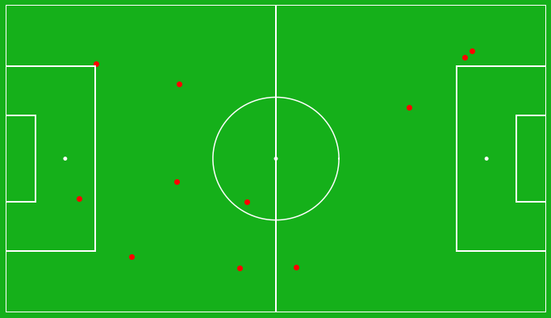

# Sport plots

### Football

__code example:__
```python
import numpy as np

# positions in X and Y coordinates between 0 and 1
positions = np.array([
    (0.02, 0.53), # GK
    (0.24, 0.15), (0.2, 0.38), (0.2, 0.65), (0.26, 0.85), # Defenders
    (0.35, 0.5), (0.40, 0.25), (0.40, 0.75), # Midfielders
    (0.5, 0.50), (0.5, 0.46), (0.5, 0.8), # Attackers
])

# set player names
names = [
    'Donnarumma',
    'Hakimi', 'Kimpembe', 'Marquinhos', 'Bernat',
    'Verratti', 'Sanches', 'Vitinha',
    'Messi', 'Neymar', 'Mbappe'
]

# add custom colors
colors = [
    'orange',
    'red', 'red', 'red', 'red',
    'blue', 'blue', 'blue',
    '#aa0bff', '#aa0bff', '#aa0bff'
]

from src import FootballPitch

# init FootballPitch
fp = FootballPitch(
    playerscolor='red', 
    bg='darkgreen', 
    textcolor='white')

# plot
fp.plot(positions, names, colors)

# convert plot to numpy array
out = fp.to_numpy()
```
__plot example:__

